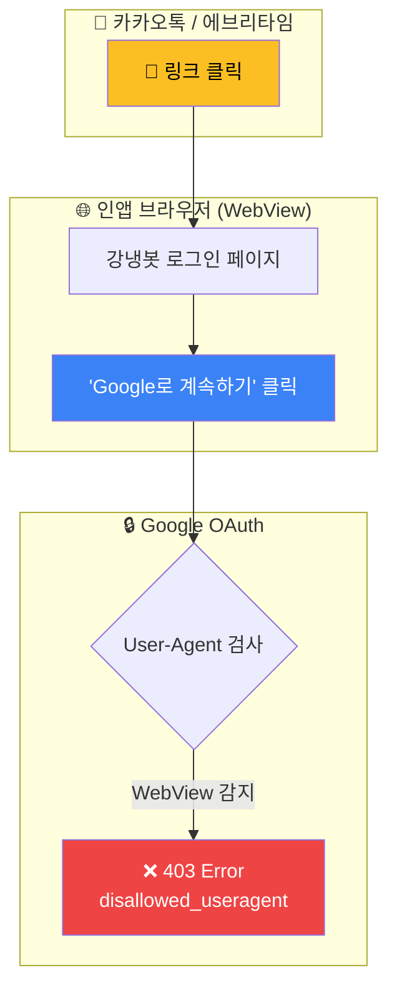
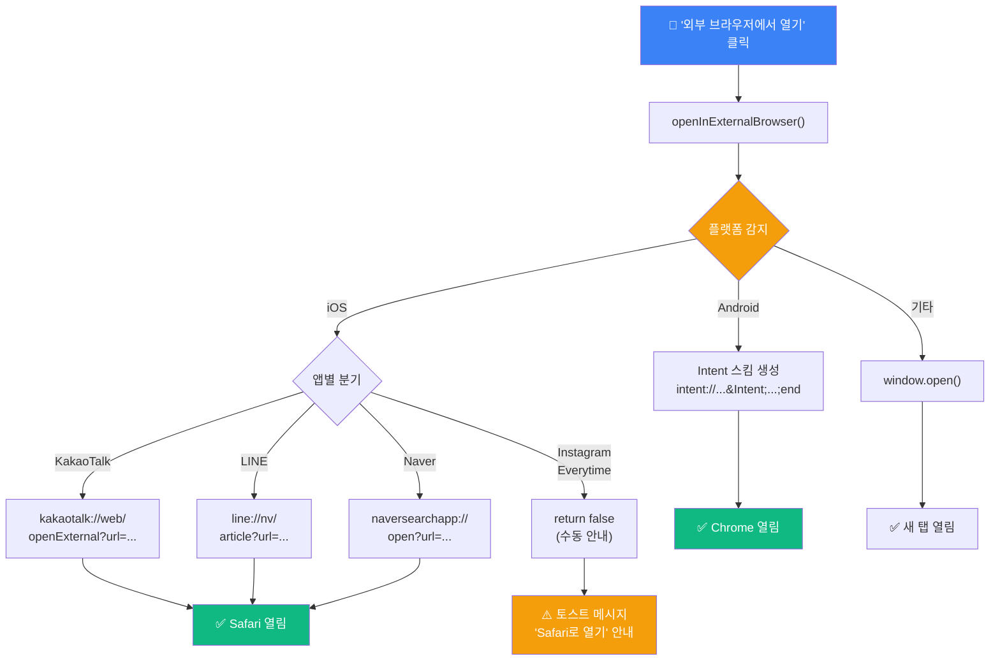
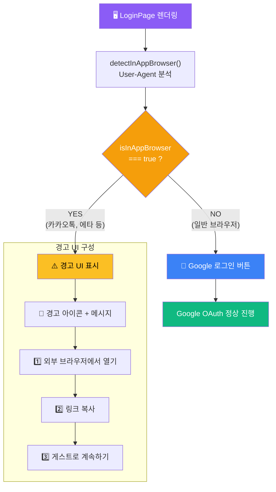
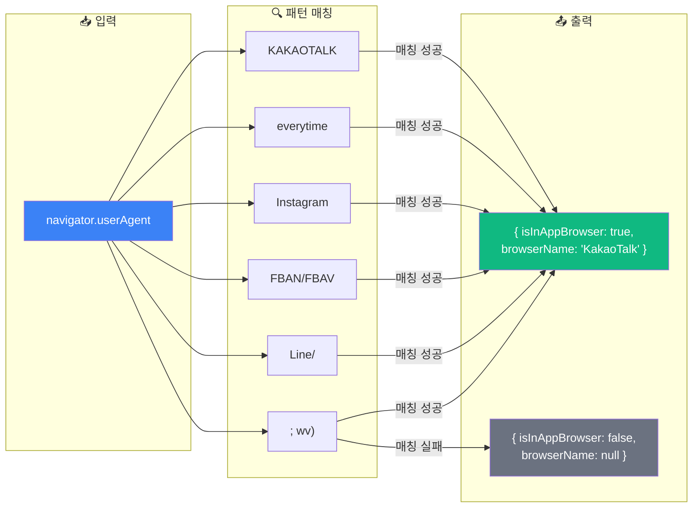

# 인앱 브라우저 해결 시스템 다이어그램

블로그 포스트에 사용할 **핵심 다이어그램 3개**입니다.
[Mermaid Live Editor](https://mermaid.live/)에서 PNG로 내보내 티스토리에 이미지로 업로드하세요.

---

## 다이어그램 1: 문제 상황 흐름도

**📍 삽입 위치**: `🎯 문제 정의` 섹션, 문제 설명 아래

---

## 다이어그램 2: 플랫폼별 분기 처리 흐름도

**📍 삽입 위치**: `💡 해결책 1: 앱별 URL 스킴 활용` 섹션, URL 스킴 목록 아래

---

## 다이어그램 3: 조건부 렌더링 흐름도

**📍 삽입 위치**: `💡 해결책 3: 인앱 브라우저 감지 시 대체 UI` 섹션

---

## 다이어그램 4: User-Agent 감지 패턴

**📍 삽입 위치**: `🔍 원인 분석` 섹션, 인앱 브라우저 감지 방법 설명 아래 (선택 사항)

---

## 📋 체크리스트

| #   | 다이어그램           | 블로그 위치                      | PNG 생성 |
| --- | -------------------- | -------------------------------- | :------: |
| 1   | 문제 상황 흐름도     | 🎯 문제 정의                     |    ☐     |
| 2   | 플랫폼별 분기 처리   | 💡 해결책 1 (URL 스킴 목록 아래) |    ☐     |
| 3   | 조건부 렌더링 흐름도 | 💡 해결책 3 (대체 UI 설명)       |    ☐     |
| 4   | User-Agent 감지 패턴 | 🔍 원인 분석 (선택 사항)         |    ☐     |

---

## 사용 방법

1. [Mermaid Live Editor](https://mermaid.live/)에 위 코드 붙여넣기
2. 우측 상단 "Actions" → "PNG" 다운로드
3. 티스토리 에디터에서 해당 위치에 이미지 삽입
4. 블로그 HTML에서 ASCII 다이어그램 부분 삭제 (이미지로 대체)
