# 📊 Mermaid 다이어그램 모음

---

## 1️⃣ 시스템 아키텍처

```mermaid
graph LR
    User((👤 User))

    subgraph Client ["🖥️ GangNaengBot Client"]
        Page["📄 Page/Component"]
        Store["📦 Zustand Store"]
        API["🔌 Axios Client"]
    end

    Server["☁️ Backend API"]

    User -- "Click/Input" --> Page
    Page -- "Action" --> Store
    Store -- "1. Optimistic Update" --> Page
    Store -- "2. Async Request" --> API
    API -- "3. HTTP Request" --> Server
    Server -- "4. Response" --> API
    API -- "5. Data Return" --> Store
    Store -- "6. Final Update" --> Page

    style Store fill:#e1f5fe,stroke:#01579b
    style API fill:#ffebee,stroke:#b71c1c
    style Page fill:#f3e5f5,stroke:#7b1fa2
```

---

## 2️⃣ Optimistic UI 시퀀스 다이어그램

```mermaid
sequenceDiagram
    participant U as 👤 User
    participant S as 📦 Store
    participant A as 🔌 API

    U->>S: sendMessage("안녕")
    activate S
    Note right of S: 1️⃣ Optimistic Update
    S->>S: messages.push("안녕")
    S-->>U: ⚡ 즉시 렌더링!

    Note right of S: 2️⃣ Background Request
    S->>A: POST /chat
    activate A

    alt ✅ Success
        A-->>S: 200 OK (AI Response)
        S->>S: messages.push(AI Response)
        S-->>U: AI 응답 표시
    else ❌ Failure
        A-->>S: Error
        Note right of S: 3️⃣ Rollback
        S->>S: messages.pop()
        S-->>U: 에러 토스트 + 원복
    end
    deactivate A
    deactivate S
```

---

## 3️⃣ 호버 프리페칭 시퀀스 다이어그램

```mermaid
sequenceDiagram
    participant User as 👤 User
    participant UI as 🖥️ Component
    participant Store as 📦 Store
    participant Cache as 🗂️ Map Cache
    participant API as 🔌 API

    Note over User, UI: 🖱️ Mouse Hover
    User->>UI: Hover Session A
    UI->>Store: prefetchSession(A)

    alt 캐시 없음
        Store->>API: getMessages(A)
        activate API
        API-->>Store: Response
        deactivate API
        Store->>Cache: set(A, messages)
    end

    Note over User, UI: 👆 Mouse Click
    User->>UI: Click Session A
    UI->>Store: selectSession(A)
    Store->>Cache: get(A)
    Cache-->>Store: messages ✅
    Store->>UI: ⚡ 즉시 렌더링 (0ms)
```

---

## 4️⃣ 재시도 로직 플로우차트

```mermaid
flowchart TD
    START([📤 메시지 전송]) --> API[API 호출]
    API --> CHECK{응답이 비어있음?}

    CHECK -->|No| SUCCESS[✅ 응답 표시]
    CHECK -->|Yes| COUNT{재시도 횟수 < 5?}

    COUNT -->|Yes| WAIT[⏳ 500ms 대기]
    WAIT --> API

    COUNT -->|No| FALLBACK[💬 친절한 안내 메시지]
    FALLBACK --> SUCCESS

    style SUCCESS fill:#dcfce7,stroke:#22c55e,stroke-width:2px
    style FALLBACK fill:#fef9c3,stroke:#eab308,stroke-width:2px
    style CHECK fill:#e0f2fe,stroke:#0284c7
```

---

## 5️⃣ Axios 인터셉터 흐름도

```mermaid
flowchart LR
    subgraph Components ["📦 Components"]
        A["Component A"]
        B["Component B"]
        C["Component C"]
    end

    subgraph Interceptor ["🔌 API Client"]
        REQ["Request\nInterceptor"]
        RES["Response\nInterceptor"]
    end

    subgraph Logic ["⚙️ Interceptor Logic"]
        TOKEN["🔑 토큰 자동 추가"]
        E401{"401 에러?"}
        LOGOUT["🚪 자동 로그아웃"]
        HANDLE["에러 정규화"]
    end

    A --> REQ
    B --> REQ
    C --> REQ
    REQ --> TOKEN
    TOKEN --> SERVER["☁️ Server"]
    SERVER --> RES
    RES --> E401
    E401 -->|Yes| LOGOUT
    E401 -->|No| HANDLE
    LOGOUT --> LOGIN["/login 리다이렉트"]

    style TOKEN fill:#dbeafe,stroke:#3b82f6,stroke-width:2px
    style LOGOUT fill:#fee2e2,stroke:#ef4444,stroke-width:2px
```

